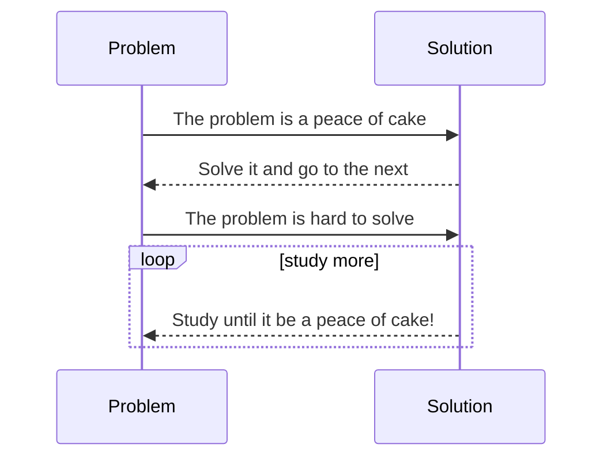

## A little about me

I'm a **Computer Engineer**, MSc in **Mecatronic Engineering**, and majoring again in **Statistcs**.
I still have time for fun because my job is my best hobby, so **I have fun everyday**! How can I be more happier?
Yeah, a simple introduction because simplicity worths a lot to me! If you want to known me a little better, reach me out on [Linkedin](https://www.linkedin.com/in/thyarles) or [Credly](https://www.credly.com/users/thyarles/badges).
  
## A little about my dutties  

But if you are asking about the value of x, it is 5 cm without any math because it is related to the **pythagorean triples**. 

Wrapping up, give me the right question to receive the right answer.

## Filosophy

